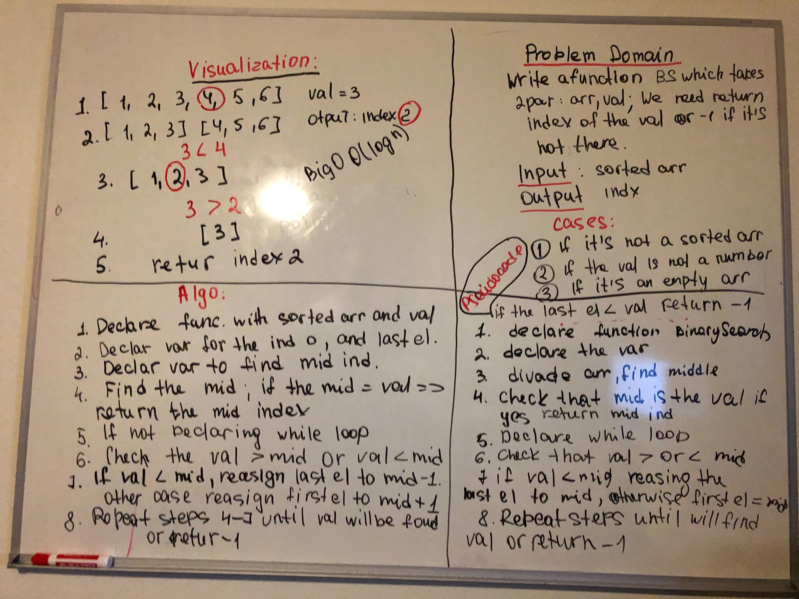

# Array Binary Search

- Write a function called arrayBinarySearch that takes a sorted array array and a targeted value. 
- return the index of the targeted value

## Challenge
- Do a binary search
- Do not use any built in function

## Approach & Efficiency
- create a variable to find middle index of array no matter the array length.
- compare that middle index to the target value index.
- use a while loop. 

## Solution

