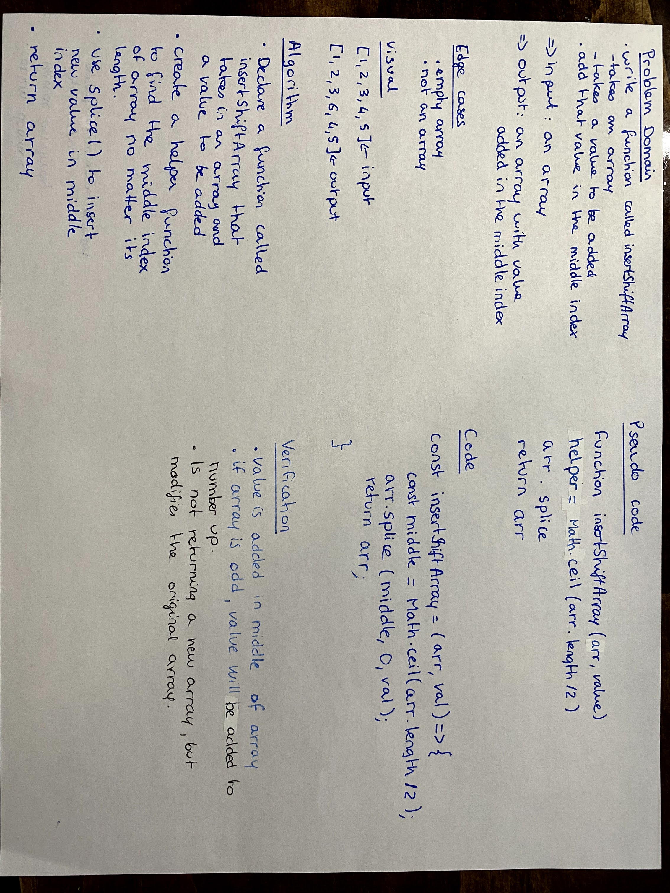

# Insert and Shift an Array

- Write a function called insertShiftArray that takes an array and a value to be added. 
- Add that value in the middle index.

## Challenge
- Do not use insert method

## Approach & Efficiency
- create a helper function to find middle index of array no matter the array length.
- use splice to add the value in the middle index.

## Solution

