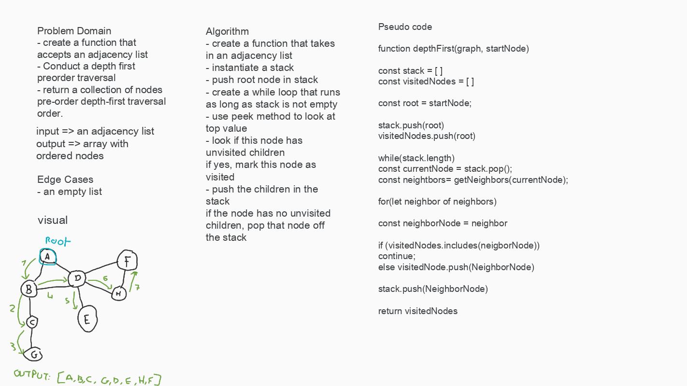

# Challenge 38 
## Depht First traversal

### Challenge
Conduct a depth first preorder traversal on a graph

Create a function that accepts an adjacency list as a graph, and conducts a depth first traversal. Without utilizing any of the built-in methods available to your language, return a collection of nodes in their pre-order depth-first traversal order.

### Approach & Efficiency
- create a stack to hold values
- push children into the stack until all children are visited then pop of the stack
- repeat until all nodes are visited

### WHITE BOARD

