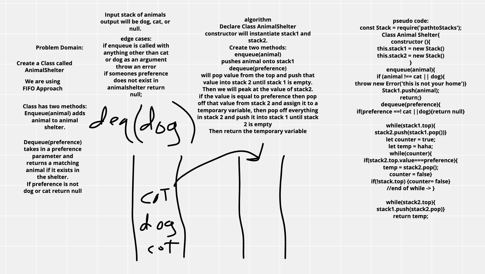

# CODE CHALLENGE 12
## fifo animal shelter

### Challenge
- Create a class called AnimalShelter which holds only dogs and cats.
- The shelter operates using a first-in, first-out approach.
- Implement the following methods:
  - enqueue(animal): adds animal to the shelter. animal can be either a dog or a cat object.
  - dequeue(pref): returns either a dog or a cat. If pref is not "dog" or "cat" then return null.

### Approach & Efficiency
- use two stacks and reverse stack to access first value in.

### WHITE BOARD
