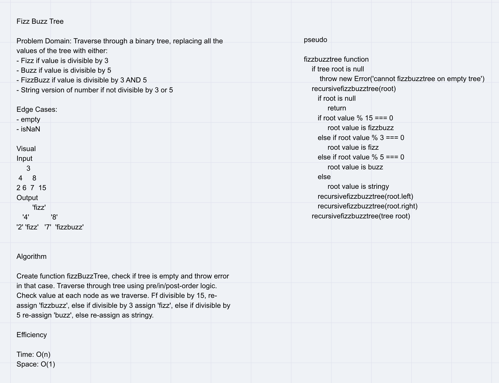

# CODE CHALLENGE 17
## fizzBuzzTree

### Challenge
- Write a function called FizzBuzzTree which takes a k-ary tree as an argument.

- If the value is divisible by 3, replace the value with “Fizz”
- If the value is divisible by 5, replace the value with “Buzz”
- If the value is divisible by 3 and 5, replace the value with “FizzBuzz”
- If the value is not divisible by 3 or 5, simply turn the number into a String.

### Approach & Efficiency
- use recursion to go over the tree and check on each single value, replace values as needed.

### WHITE BOARD
