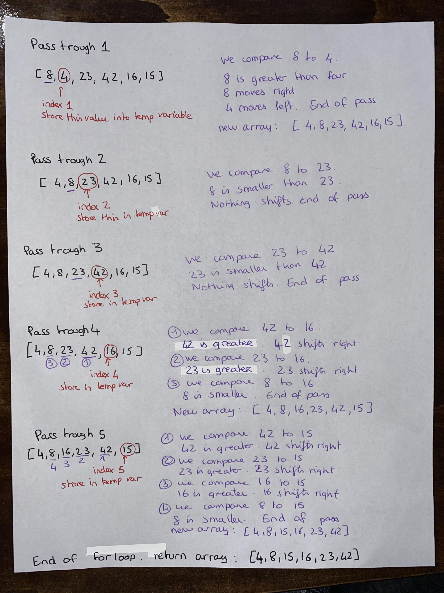

# Insertion Sort

Let's apply Insertion Sort to the array `[8,4,23,42,16,15]`

We start a loop that will run throug the entire array. Each round represent a pass through.

We begin the first pass through at index 1 

We store that value into a variable calle temp. 

We create a second variable called j that represents each values of the array that we will compare to the value stored in temp.

For the first pass it will start at index 0 or index-1.

We create a nested loop that rans as long as j is greater than 0.

We compare the the value at index j with the value stored in temp: 
- if value at j is greater than temp: value at j is put to the right of temp.
- reassign j to j-1 to compare next left value to temp
- end of passthrough when we reach a vale that is lower than temp.

For each following pass through we increment index by 1 and redo all steps until we reach the array's length.

