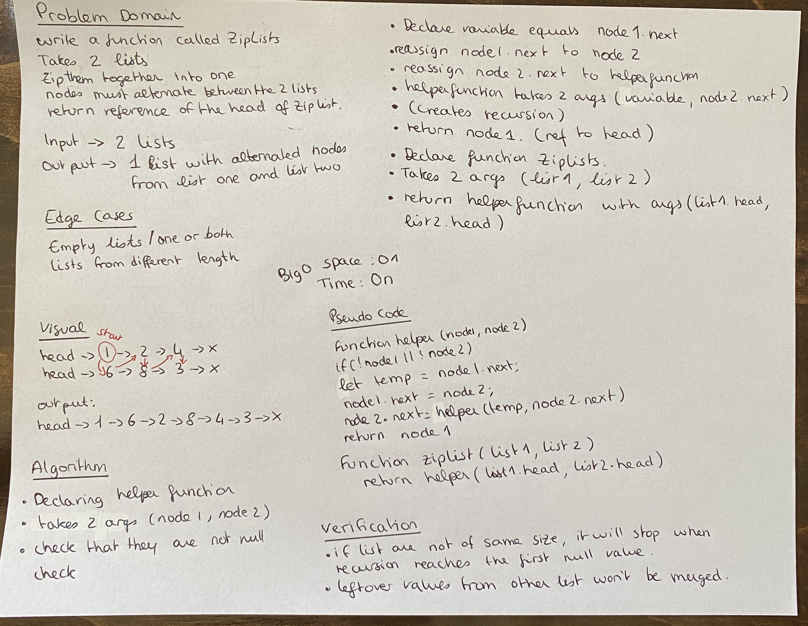

# CODE CHALLENGE 08
## Zip lists

### Challenge
- Zip two linked lists together where nodes alternate between the two lists

### Approach & Efficiency
- create a helper function to create a recursion

### WHITE BOARD
