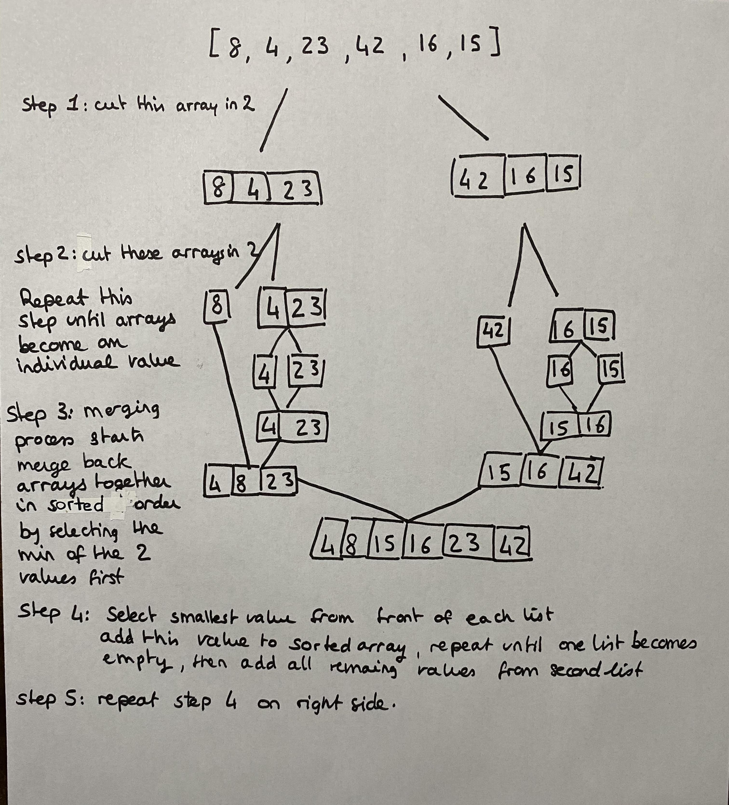

# Merging Sort

1. split array in the middle
2. select left sub array
3. split the selected array
4. select left sub array
5. Repeat step 3 and 4 until array contain one individual value
6. When size of the array is one it is ready to merge
7. Select min of two values
8. add to empty array, then add value from the second list
9. repeat steps 3 to 8 on the right sub array
10. When two sorted arrays are ready to merge, select the values from the front of each list 
11. select the min of the 2 values
12. add to the empty array
13. select new front value and select the min of the two values
14. repeat until the two lists are sorted into the final array

