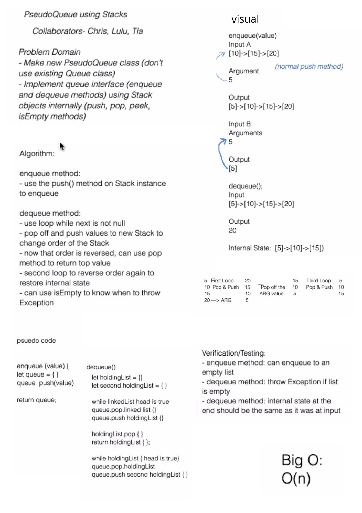

# CODE CHALLENGE 11
## queue with stacks

### Challenge
- Implement a Queue using two Stacks

### Approach & Efficiency
- use Stack methods to create enqueue and dequeue methods
- movie nodes back and forth to both stacks to access values we are looking for.

### WHITE BOARD
