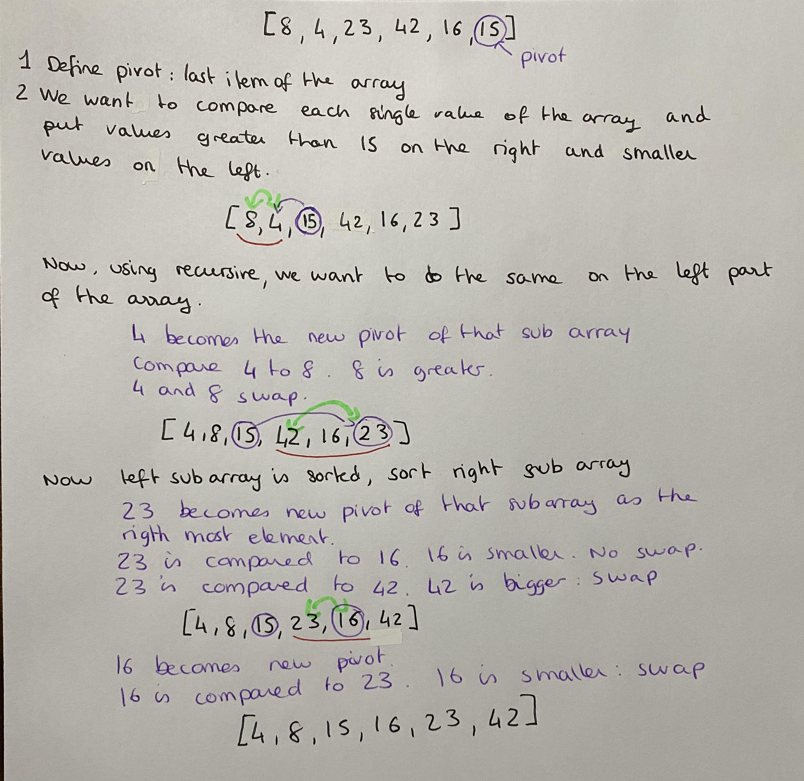

# Merging Sort

1. Pass in function array, start and end of the array.
1. define pivot as the rightmost element of the array
1. I want to put everyting smaller that the pivot value on the left side of that value, and everything bigger that the pivot value on the right side
1. itterate over every single element of the array and compare it agains the pivot
1. every value smaller than the pivot get put on the left side of the array, greater values go n the right side of the array
1. swap the pivot with the first number greater than the pivot.
1. use recursion to break down array into sub arrays of 1 value and swap values to reconstruct values in a sorted order

