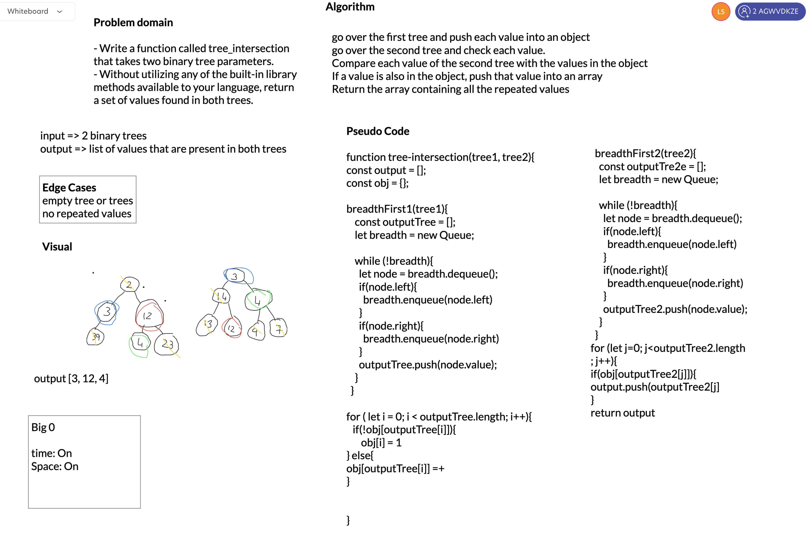

# CodeChallenge 32
## Tree Intersection

### Challenge
- Write a function called tree_intersection that takes two binary tree parameters.
- Without utilizing any of the built-in library methods available to your language, return a set of values found in both trees.

### Approach & Efficiency

- use Breadth first to travel throug the first tree, put all the values into an array
- use Breath first to travel thourgh the second tree.
- while travelling through the second tree, compare each value to the values from the first tree. If a value is present in both tree push it into a new array
- return the new array that contains all the repeated values.

### WHITE BOARD
