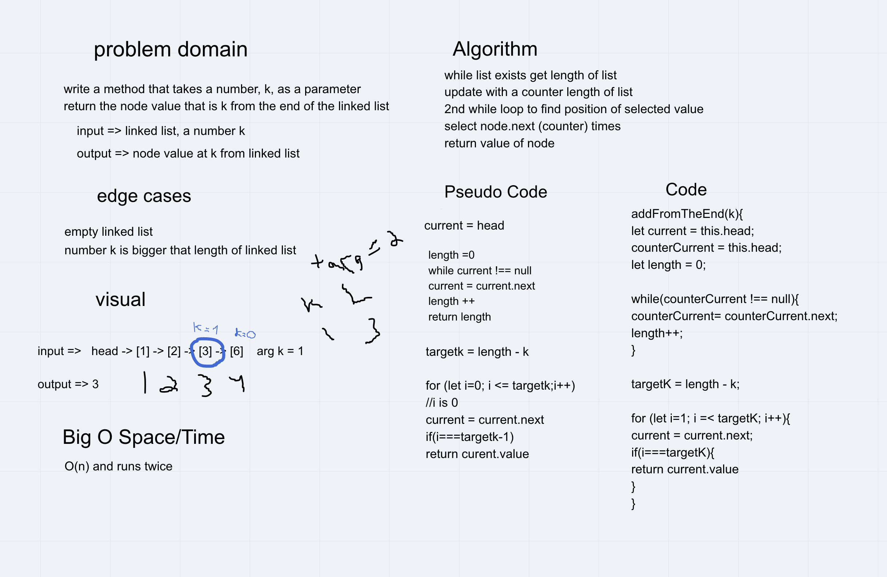

# Singly Linked List
- Create a Node class that has properties for the value stored in the Node, and a pointer to the next Node.
- Within your LinkedList class, include a head property. Upon instantiation, an empty Linked List should be created.
  - Define a method called insert which takes any value as an argument and adds a new node with that value to the head of the list with an O(1) Time performance.
  - Define a method called includes which takes any value as an argument and returns a boolean result depending on whether that value exists as a Node’s value somewhere within the list.
  - Define a method called toString which takes in no arguments and returns a string representing all the values in the Linked List, formatted as:
    -  "{ a } -> { b } -> { c } -> NULL"

## TEST
- Can successfully instantiate an empty linked list
- Can properly insert into the linked list
- The head property will properly point to the first node in the linked list
- Can properly insert multiple nodes into the linked list
- Will return true when finding a value within the linked list that exists
- Will return false when searching for a value in the linked list that does not exist
- Can properly return a collection of all the values that exist in the linked lis

## CODE CHALLENGE 06

- append(value) which adds a new node with the given value to the end of the list
- insertBefore(value, newVal) which add a new node with the given newValue immediately before the first value node
- insertAfter(value, newVal) which add a new node with the given newValue immediately after the first value node

### WHITEBOARD

## CODE CHALLENGE 07

Write a method for the Linked List class which takes a number, k, as a parameter. Return the node’s value that is k from the end of the linked list. 

### WHITEBOARD

