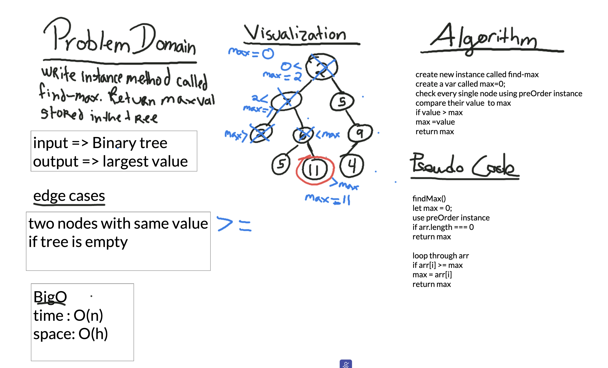

## Code challenge 15

- Create a Node class that has properties for the value stored in the node, the left child node, and the right child node.
- Create a BinaryTree class
  - Define a method for each of the depth first traversals called preOrder, inOrder, and postOrder which returns an array of the values, ordered appropriately.
- Create a BinarySearchTree class
  - Define a method named add that accepts a value, and adds a new node with that value in the correct location in the binary search tree.
  - Define a method named contains that accepts a value, and returns a boolean indicating whether or not the value is in the tree at least once.

## Code Challenge 16

**find-maximum-value**

- Write an instance method called find-maximum-value.
- Without utilizing any of the built-in methods available to your language, return the maximum value stored in the tree. 
- You can assume that the values stored in the Binary Tree will be numeric.

### WHITEBOARD

## Code Challenge 18

**Breadth-first Traversal**

- Write a breadth first traversal method which takes a Binary Tree as its unique input. W
- traverse the input tree using a Breadth-first approach
- return a list of the values in the tree in the order they were encountered.

### WHITEBOARD

